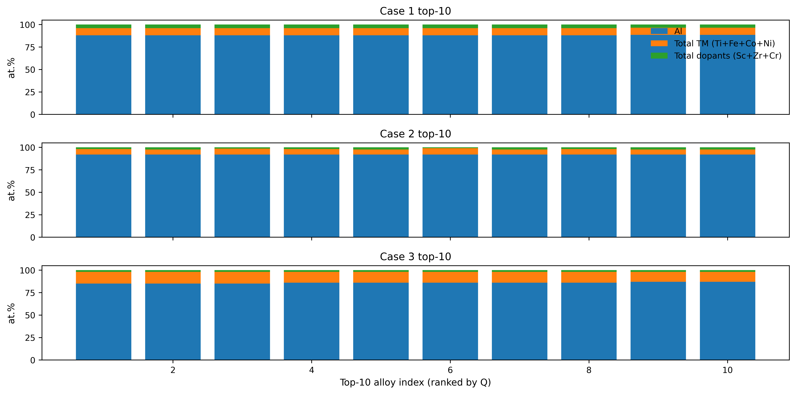

# ML-Guided Microalloying of Al₉₂(Ti,Fe,Co,Ni)₂ for Additive Manufacturing

This repository contains the analysis and plotting scripts used to explore ML-guided
microalloying around the ultrastrong Al₉₂Ti₂Fe₂Co₂Ni₂ alloy system for additive
manufacturing. It builds on the trained models from the main Al-alloy ICME paper and
uses them to:

- generate microalloying design spaces around Al₉₂Ti₂Fe₂Co₂Ni₂  
- predict yield strength (YS), ultimate tensile strength (UTS), elongation (El), and a
  strength–ductility quality index **Q**  
- identify top-Q candidate alloys under different microalloying scenarios  
- visualize strength–ductility maps, Q vs dopant content, and composition fingerprints
  for the best candidates 

All analysis is done with pre-trained ML models stored in
`models_cfg10b_highEI_softWeights_v4.joblib`. 


## Repository structure

Key files and their roles:

- **Data**
  - `AM_Casting_MLReady_Cleaned_Final_v4.csv`  
    Main multi-process Al-alloy training dataset (cast, wrought, AM) used to train the
    ML models. 
  - `Al92_microalloying_MLReady.csv`  
    ML-ready design space for Al₉₂(Ti,Fe,Co,Ni)₂ + microalloying.
  - `Al92_microalloying_with_predictions.csv`  
    Same design space with ML predictions (YS, UTS, El, Q) added.
  - `case1_all_predictions.csv`, `case2_all_predictions.csv`, `case3_all_predictions.csv`  
    Full prediction tables for three microalloying scenarios (“Case 1–3”). 
  - `case1_top10_by_Q.csv`, `case2_top10_by_Q.csv`, `case3_top10_by_Q.csv`  
    Top-10 alloys by **Q** within each case.
  - `predicted_alloy_sets_top60_clustered.csv`  
    Top-60 high-Q predictions clustered into 3 sets for “Pareto-like” visualization. 
  - `external_alloys_cfg10b_highEI_softWeights_v4.csv` (or similar)  
    Optional: external or validation alloys used in some analyses.

- **Models**
  - `models_cfg10b_highEI_softWeights_v4.joblib`  
    Serialized Python dict containing trained ML models for YS, UTS, and Elongation. 

- **Core scripts**
  - `generate_Al92_microalloying_designspace.py`  
    Builds the composition-only design space around Al₉₂Ti₂Fe₂Co₂Ni₂ by adding Sc, Cr,
    Zr, Mg, Ag, V, Cu, Mn in different at.% increments and writes
    `Al92_microalloying_designspace_composition_only.csv`. 
  - `analyze_Al92_microalloying_v3.py`, `analyze_Al92_microalloying_v4.py`  
    Load the pre-trained models, apply them to the design space, compute **Q**, and
    save prediction CSVs for downstream plotting.
  - `analyze_TM_dopant_designspace_v6.py`  
    Generates the three microalloying scenarios (Case 1–3), runs predictions, and
    writes `case*_all_predictions.csv` and `case*_top10_by_Q.csv`.
  - `plot_slide_style_figures.py`  
    Produces the three main figure panels for the microalloying analysis:
      - `Fig1_strength_ductility_cases.png`: UTS vs Elongation colored by Q for Case 1–3  
      - `Fig2_Q_vs_pure_dopants_cases.png`: Q vs dopant content (Sc, Zr, Cr)  
      - `Fig3_top10_composition_fingerprints.png`: stacked-bar composition fingerprints
        for top-10 alloys in each case 
  - `plot_all_results.py`  
    Produces “paper-style” summary figures:
      - `FigA_strength_ductility_with_cases.png`: microalloyed design space overlaid on
        the Al ≥ 80 at.% training data cloud  
      - `FigB_element_correlations.png`: Pearson correlations between element contents
        and predicted UTS/El  
      - `FigC_predicted_sets_scatter.png`: clustered top-60 alloys in the
        strength–ductility plane, plus the `predicted_alloy_sets_top60_clustered.csv`
        file with cluster labels 
  - `check_joblib.py`  
    Small helper script to inspect the contents of `models_cfg10b_highEI_softWeights_v4.joblib`.

- **Figures (generated)**
  - `Fig1_strength_ductility_cases.png`  
  - `Fig2_Q_vs_pure_dopants_cases.png`  
  - `Fig3_top10_composition_fingerprints.png`  
  - `FigA_strength_ductility_with_cases.png`  
  - `FigB_element_correlations.png`  
  - `FigC_predicted_sets_scatter.png`  

The stacked-bar composition fingerprints for Case 1–3 look like this:




## Microalloying cases

The repository explores three related microalloying scenarios around the Al–Ti–Fe–Co–Ni
base:

- **Case 1**: Total transition metals (Ti+Fe+Co+Ni) fixed at 8 at.%; vary Al and pure
  Sc/Zr/Cr additions.  
- **Case 2**: Al fixed at 92 at.%; vary TM content and pure Sc/Zr/Cr.  
- **Case 3**: Full enumeration of Al, TM, and Sc/Zr/Cr within chosen bounds.   

Each case is evaluated with the ML models, **Q** is computed, and top-ranked alloys
are analyzed and plotted.


## Installation

1. **Clone the repository**

```bash
git clone https://github.com/<your-username>/<repo-name>.git
cd <repo-name>
Create and activate a Python environment (recommended)

bash
Copy code
python -m venv .venv
source .venv/bin/activate   # on Linux/macOS
# .venv\Scripts\activate    # on Windows
Install dependencies

If you have a requirements.txt, use that; otherwise:

bash
Copy code
pip install numpy pandas matplotlib scikit-learn joblib
Typical workflow
1. Generate the microalloying design space (optional)
If you want to regenerate the composition grid around Al₉₂Ti₂Fe₂Co₂Ni₂:

bash
Copy code
python generate_Al92_microalloying_designspace.py
This will create Al92_microalloying_designspace_composition_only.csv with all chosen
Sc/Cr/Zr/Mg/Ag/V/Cu/Mn dopant levels.

2. Run ML predictions on the design space
Use the analysis scripts to attach ML predictions (YS, UTS, El) and compute Q:

bash
Copy code
python analyze_Al92_microalloying_v4.py
# or
python analyze_TM_dopant_designspace_v6.py
These scripts:

load the trained models from models_cfg10b_highEI_softWeights_v4.joblib

apply them to the design space

write Al92_microalloying_with_predictions.csv,
case*_all_predictions.csv, and case*_top10_by_Q.csv.

3. Make slide-style figures for the microalloying study
bash
Copy code
python plot_slide_style_figures.py
This produces:

Fig1_strength_ductility_cases.png

Fig2_Q_vs_pure_dopants_cases.png

Fig3_top10_composition_fingerprints.png

4. Generate summary figures and clustered top-Q alloys
bash
Copy code
python plot_all_results.py
This script:

overlays predicted alloys (Case 1–3) on the training strength–ductility cloud

computes simple element–property correlations for UTS and El

clusters the top 60 alloys by Q into three sets (K-means in the UTS–El plane)

writes predicted_alloy_sets_top60_clustered.csv and the three
FigA/B/C_*.png figures.

5. Inspecting the model file (optional)
To see what is stored inside the joblib file:

bash
Copy code
python check_joblib.py
Customization
Plot styling
Both plotting scripts expose figure sizes, DPI, and font family at the top of the file
(FIG_DPI, FONT_FAMILY, etc.), so you can easily tune the style for slides or
manuscripts.

Cases / design space
If you want different microalloying ranges or different dopants, edit the loops and
dopant lists in generate_Al92_microalloying_designspace.py and the case definitions
in analyze_TM_dopant_designspace_v6.py.

Quality index Q
Q is computed in the same way as in the main paper (weighted combination of strength
and log-elongation). You can experiment with different weightings directly in the
analysis script that calculates Q.

Citation
If you use this repository or its figures in a publication, please cite the associated
Al-alloy ICME paper (preprint / journal reference) and, if appropriate, the GitHub
repository.
